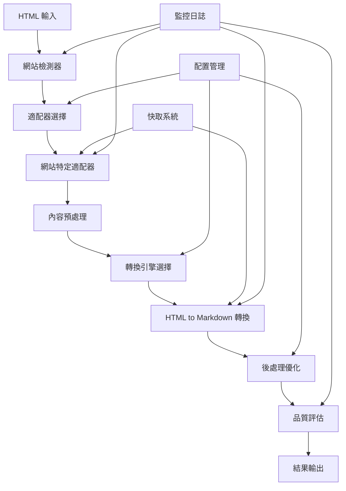

# LLMFeeder 通用 HTML to Markdown 轉換程式實現指南

## 專案概述

本文檔詳細說明如何基於 LLMFeeder 瀏覽器擴展的經驗，實現一個通用的 HTML to Markdown 轉換程式，該程式能夠：

1. **通用多網站支援**：透過適配器模式支援多個指定網站
2. **易於擴充**：新增網站時只需添加對應的適配器
3. **ETL 流程整合**：完整整合到代理爬蟲系統的 ETL 流程中
4. **高品質轉換**：提供多種轉換引擎和智能內容提取

## 技術架構設計

### 核心組件架構



### 模組化設計

#### 1. 核心轉換引擎 (`core.py`)
```python
class HTMLToMarkdownConverter(ABC):
    """HTML to Markdown 轉換器抽象基類"""
    
    @abstractmethod
    async def convert(self, html: str, config: ConversionConfig) -> ConversionResult:
        """執行 HTML 到 Markdown 的轉換"""
        pass
    
    @abstractmethod
    def validate_html(self, html: str) -> bool:
        """驗證 HTML 內容的有效性"""
        pass
```

#### 2. 網站適配器系統 (`adapters.py`)
```python
class WebsiteAdapter(ABC):
    """網站特定適配器抽象基類"""
    
    @abstractmethod
    def detect_website(self, url: str, html: str) -> bool:
        """檢測是否為目標網站"""
        pass
    
    @abstractmethod
    def preprocess_html(self, html: str) -> str:
        """網站特定的 HTML 預處理"""
        pass
    
    @abstractmethod
    def extract_content(self, html: str) -> Dict[str, Any]:
        """提取網站特定的內容結構"""
        pass
```

#### 3. ETL 處理器 (`etl_processor.py`)
```python
class HTMLToMarkdownETLProcessor:
    """HTML to Markdown ETL 處理器"""
    
    async def process_html_content(self, html: str, url: str = None) -> ETLResult:
        """處理單個 HTML 內容的完整 ETL 流程"""
        pass
    
    async def process_batch_files(self, file_paths: List[str]) -> List[ETLResult]:
        """批次處理多個 HTML 檔案"""
        pass
```

## 具體實現方案

### 1. 網站適配器實現範例

#### Medium 適配器
```python
class MediumAdapter(WebsiteAdapter):
    """Medium 網站專用適配器"""
    
    def detect_website(self, url: str, html: str) -> bool:
        """檢測是否為 Medium 網站"""
        return (
            'medium.com' in url.lower() or
            'data-testid="storyContent"' in html or
            'class="pw-post-body-paragraph"' in html
        )
    
    def preprocess_html(self, html: str) -> str:
        """Medium 特定的 HTML 預處理"""
        soup = BeautifulSoup(html, 'lxml')
        
        # 移除 Medium 特有的廣告和推薦內容
        for element in soup.find_all(['div'], class_=[
            'js-postMetaLockup', 'u-marginTop20', 'js-trackedPost'
        ]):
            element.decompose()
        
        # 保留主要內容區域
        main_content = soup.find('article') or soup.find('div', {'data-testid': 'storyContent'})
        if main_content:
            return str(main_content)
        
        return str(soup)
    
    def extract_content(self, html: str) -> Dict[str, Any]:
        """提取 Medium 文章的結構化內容"""
        soup = BeautifulSoup(html, 'lxml')
        
        # 提取標題
        title = None
        title_selectors = ['h1', '[data-testid="storyTitle"]', '.graf--title']
        for selector in title_selectors:
            title_elem = soup.select_one(selector)
            if title_elem:
                title = title_elem.get_text().strip()
                break
        
        # 提取作者
        author = None
        author_elem = soup.select_one('[data-testid="authorName"]') or soup.select_one('.ds-link')
        if author_elem:
            author = author_elem.get_text().strip()
        
        # 提取發布日期
        publish_date = None
        date_elem = soup.select_one('time') or soup.select_one('[data-testid="storyPublishDate"]')
        if date_elem:
            publish_date = date_elem.get('datetime') or date_elem.get_text().strip()
        
        # 提取標籤
        tags = []
        tag_elements = soup.select('[data-testid="storyTags"] a, .js-tagButton')
        for tag_elem in tag_elements:
            tags.append(tag_elem.get_text().strip())
        
        return {
            'title': title,
            'author': author,
            'publish_date': publish_date,
            'tags': tags,
            'content_type': 'article',
            'website': 'Medium'
        }
```

#### GitHub 適配器
```python
class GitHubAdapter(WebsiteAdapter):
    """GitHub 網站專用適配器"""
    
    def detect_website(self, url: str, html: str) -> bool:
        """檢測是否為 GitHub 網站"""
        return (
            'github.com' in url.lower() or
            'class="markdown-body"' in html or
            'data-testid="readme"' in html
        )
    
    def preprocess_html(self, html: str) -> str:
        """GitHub 特定的 HTML 預處理"""
        soup = BeautifulSoup(html, 'lxml')
        
        # 移除 GitHub 特有的導航和側邊欄
        for element in soup.find_all(['nav', 'header', 'footer']):
            element.decompose()
        
        # 移除廣告和推薦內容
        for element in soup.find_all(['div'], class_=[
            'BorderGrid-cell', 'Layout-sidebar', 'js-sticky'
        ]):
            element.decompose()
        
        # 保留主要內容
        main_content = (
            soup.find('div', class_='markdown-body') or
            soup.find('article') or
            soup.find('div', {'data-testid': 'readme'})
        )
        
        if main_content:
            return str(main_content)
        
        return str(soup)
    
    def extract_content(self, html: str) -> Dict[str, Any]:
        """提取 GitHub 內容的結構化資訊"""
        soup = BeautifulSoup(html, 'lxml')
        
        # 提取倉庫名稱
        repo_name = None
        repo_elem = soup.select_one('[data-testid="AppHeader-context-item-label"]')
        if repo_elem:
            repo_name = repo_elem.get_text().strip()
        
        # 提取檔案路徑
        file_path = None
        breadcrumb = soup.select('.js-path-segment')
        if breadcrumb:
            file_path = '/'.join([elem.get_text().strip() for elem in breadcrumb])
        
        # 提取程式語言
        language = None
        lang_elem = soup.select_one('.BorderGrid-cell .color-fg-default')
        if lang_elem:
            language = lang_elem.get_text().strip()
        
        return {
            'repository': repo_name,
            'file_path': file_path,
            'language': language,
            'content_type': 'code_documentation',
            'website': 'GitHub'
        }
```

### 2. 轉換引擎選擇策略

```python
class ConversionEngineSelector:
    """轉換引擎選擇器"""
    
    def select_best_engine(self, html: str, website_type: str) -> ConversionEngine:
        """根據內容類型選擇最佳轉換引擎"""
        
        # 根據網站類型選擇
        if website_type in ['Medium', 'Blog', 'News']:
            return ConversionEngine.TRAFILATURA  # 最適合文章內容
        elif website_type in ['GitHub', 'Documentation']:
            return ConversionEngine.MARKDOWNIFY  # 保持代碼格式
        elif website_type in ['Forum', 'Discussion']:
            return ConversionEngine.HTML2TEXT    # 處理複雜結構
        else:
            return ConversionEngine.READABILITY  # 通用內容提取
    
    def get_fallback_engines(self, primary_engine: ConversionEngine) -> List[ConversionEngine]:
        """獲取備用轉換引擎列表"""
        all_engines = list(ConversionEngine)
        all_engines.remove(primary_engine)
        return all_engines
```

### 3. ETL 流程整合

```python
class HTMLToMarkdownETLProcessor:
    """HTML to Markdown ETL 處理器"""
    
    def __init__(self, config: ETLConfig):
        self.config = config
        self.adapter_manager = AdapterManager()
        self.converter_factory = ConverterFactory()
        self.engine_selector = ConversionEngineSelector()
        self.logger = get_logger(__name__)
    
    async def process_html_content(self, html: str, url: str = None) -> ETLResult:
        """處理單個 HTML 內容的完整 ETL 流程"""
        
        try:
            # 1. Extract 階段：檢測網站並選擇適配器
            adapter = self.adapter_manager.get_adapter(url, html)
            
            # 2. Transform 階段：HTML 預處理和轉換
            preprocessed_html = adapter.preprocess_html(html)
            
            # 選擇最佳轉換引擎
            website_type = adapter.__class__.__name__.replace('Adapter', '')
            engine = self.engine_selector.select_best_engine(preprocessed_html, website_type)
            
            # 執行轉換
            converter = self.converter_factory.create_converter(engine)
            conversion_config = ConversionConfig(
                engine=engine,
                content_scope=ContentScope.MAIN_CONTENT,
                output_format=OutputFormat.MARKDOWN,
                enable_caching=True
            )
            
            conversion_result = await converter.convert(preprocessed_html, conversion_config)
            
            # 提取結構化內容
            structured_content = adapter.extract_content(html)
            
            # 3. Load 階段：保存結果
            if self.config.save_results:
                await self._save_result(conversion_result, structured_content, url)
            
            return ETLResult(
                success=True,
                markdown_content=conversion_result.markdown,
                structured_data=structured_content,
                metadata=conversion_result.metadata,
                processing_time=conversion_result.processing_time,
                quality_score=conversion_result.quality_score
            )
            
        except Exception as e:
            self.logger.error(f"ETL 處理失敗: {str(e)}")
            return ETLResult(
                success=False,
                error_message=str(e),
                markdown_content="",
                structured_data={},
                metadata={}
            )
    
    async def process_batch_files(self, file_paths: List[str]) -> List[ETLResult]:
        """批次處理多個 HTML 檔案"""
        results = []
        
        for file_path in file_paths:
            try:
                async with aiofiles.open(file_path, 'r', encoding='utf-8') as f:
                    html_content = await f.read()
                
                result = await self.process_html_content(html_content, file_path)
                results.append(result)
                
            except Exception as e:
                self.logger.error(f"處理檔案 {file_path} 失敗: {str(e)}")
                results.append(ETLResult(
                    success=False,
                    error_message=str(e),
                    markdown_content="",
                    structured_data={},
                    metadata={'file_path': file_path}
                ))
        
        return results
```

## 具體操作流程

### 1. 基本使用方式

```python
# 快速轉換單個 HTML 內容
from html_to_markdown import quick_convert

html_content = "<h1>標題</h1><p>內容...</p>"
markdown_result = await quick_convert(html_content, url="https://medium.com/article")
print(markdown_result)
```

### 2. 自定義配置使用

```python
# 使用自定義配置
from html_to_markdown import HTMLToMarkdownETLProcessor, ETLConfig

config = ETLConfig(
    output_directory="./output",
    save_results=True,
    enable_quality_assessment=True,
    min_quality_score=0.7
)

processor = HTMLToMarkdownETLProcessor(config)
result = await processor.process_html_content(html_content, url)
```

### 3. 批次處理

```python
# 批次處理多個檔案
file_paths = [
    "./data/medium_article.html",
    "./data/github_readme.html",
    "./data/blog_post.html"
]

results = await processor.process_batch_files(file_paths)

# 生成處理報告
report = processor.generate_processing_report(results)
print(report)
```

### 4. 新增網站適配器

```python
# 新增 Stack Overflow 適配器
class StackOverflowAdapter(WebsiteAdapter):
    """Stack Overflow 網站專用適配器"""
    
    def detect_website(self, url: str, html: str) -> bool:
        return 'stackoverflow.com' in url.lower()
    
    def preprocess_html(self, html: str) -> str:
        soup = BeautifulSoup(html, 'lxml')
        
        # 移除側邊欄和廣告
        for element in soup.find_all(['div'], class_=['sidebar', 'js-sidebar']):
            element.decompose()
        
        # 保留問題和答案內容
        main_content = soup.find('div', id='content')
        return str(main_content) if main_content else str(soup)
    
    def extract_content(self, html: str) -> Dict[str, Any]:
        soup = BeautifulSoup(html, 'lxml')
        
        # 提取問題標題
        title_elem = soup.select_one('.question-hyperlink, h1[itemprop="name"]')
        title = title_elem.get_text().strip() if title_elem else None
        
        # 提取標籤
        tags = []
        tag_elements = soup.select('.post-tag')
        for tag_elem in tag_elements:
            tags.append(tag_elem.get_text().strip())
        
        return {
            'title': title,
            'tags': tags,
            'content_type': 'qa',
            'website': 'StackOverflow'
        }

# 註冊新適配器
from html_to_markdown.adapters import AdapterManager

adapter_manager = AdapterManager()
adapter_manager.register_adapter(StackOverflowAdapter())
```

## 與 ETL 流程的整合

### 1. 在爬蟲系統中的整合

```python
# 在爬蟲中整合 HTML to Markdown 轉換
class ProxyCrawlerWithMarkdown:
    """整合 Markdown 轉換的代理爬蟲"""
    
    def __init__(self):
        self.html_processor = HTMLToMarkdownETLProcessor(ETLConfig())
    
    async def crawl_and_convert(self, url: str) -> CrawlResult:
        """爬取網頁並轉換為 Markdown"""
        
        # 1. Extract: 爬取 HTML 內容
        html_content = await self.fetch_html(url)
        
        # 2. Transform: HTML to Markdown 轉換
        etl_result = await self.html_processor.process_html_content(html_content, url)
        
        # 3. Load: 保存結果
        if etl_result.success:
            await self.save_markdown(etl_result.markdown_content, url)
            
        return CrawlResult(
            url=url,
            success=etl_result.success,
            markdown_content=etl_result.markdown_content,
            structured_data=etl_result.structured_data
        )
```

### 2. 與 LLM 上下文管理的整合

```python
# 為 LLM 準備上下文
class LLMContextManager:
    """LLM 上下文管理器"""
    
    def __init__(self):
        self.html_processor = HTMLToMarkdownETLProcessor(ETLConfig())
    
    async def prepare_context_from_url(self, url: str) -> str:
        """從 URL 準備 LLM 上下文"""
        
        # 爬取並轉換為 Markdown
        html_content = await self.fetch_html(url)
        etl_result = await self.html_processor.process_html_content(html_content, url)
        
        if etl_result.success:
            # 格式化為 LLM 友好的格式
            context = f"""
# 網頁內容摘要

**來源**: {url}
**網站**: {etl_result.structured_data.get('website', 'Unknown')}
**標題**: {etl_result.structured_data.get('title', 'No Title')}
**品質評分**: {etl_result.quality_score:.2f}

## 內容

{etl_result.markdown_content}
"""
            return context
        else:
            return f"無法處理 URL: {url}，錯誤: {etl_result.error_message}"
```

## 擴展性設計

### 1. 插件系統

```python
# 插件接口
class ConverterPlugin(ABC):
    """轉換器插件接口"""
    
    @abstractmethod
    def get_name(self) -> str:
        """獲取插件名稱"""
        pass
    
    @abstractmethod
    def convert(self, html: str, config: Dict[str, Any]) -> str:
        """執行轉換"""
        pass

# 插件管理器
class PluginManager:
    """插件管理器"""
    
    def __init__(self):
        self.plugins: Dict[str, ConverterPlugin] = {}
    
    def register_plugin(self, plugin: ConverterPlugin):
        """註冊插件"""
        self.plugins[plugin.get_name()] = plugin
    
    def get_plugin(self, name: str) -> ConverterPlugin:
        """獲取插件"""
        return self.plugins.get(name)
```

### 2. 配置驅動的適配器

```yaml
# website_adapters.yaml
adapters:
  medium:
    detection:
      url_patterns: ["medium.com", "*.medium.com"]
      html_indicators: ['data-testid="storyContent"']
    preprocessing:
      remove_selectors:
        - ".js-postMetaLockup"
        - ".u-marginTop20"
      keep_selectors:
        - "article"
        - '[data-testid="storyContent"]'
    extraction:
      title: "h1, [data-testid='storyTitle']"
      author: '[data-testid="authorName"]'
      date: "time, [data-testid='storyPublishDate']"
      tags: '[data-testid="storyTags"] a'
```

### 3. 監控和品質保證

```python
# 品質監控
class QualityMonitor:
    """轉換品質監控器"""
    
    def __init__(self):
        self.metrics = {
            'total_conversions': 0,
            'successful_conversions': 0,
            'average_quality_score': 0.0,
            'processing_times': []
        }
    
    def record_conversion(self, result: ConversionResult):
        """記錄轉換結果"""
        self.metrics['total_conversions'] += 1
        
        if result.success:
            self.metrics['successful_conversions'] += 1
            self.metrics['processing_times'].append(result.processing_time)
            
            # 更新平均品質評分
            current_avg = self.metrics['average_quality_score']
            total_successful = self.metrics['successful_conversions']
            self.metrics['average_quality_score'] = (
                (current_avg * (total_successful - 1) + result.quality_score) / total_successful
            )
    
    def get_performance_report(self) -> Dict[str, Any]:
        """獲取性能報告"""
        success_rate = (
            self.metrics['successful_conversions'] / self.metrics['total_conversions']
            if self.metrics['total_conversions'] > 0 else 0
        )
        
        avg_processing_time = (
            sum(self.metrics['processing_times']) / len(self.metrics['processing_times'])
            if self.metrics['processing_times'] else 0
        )
        
        return {
            'success_rate': success_rate,
            'average_quality_score': self.metrics['average_quality_score'],
            'average_processing_time': avg_processing_time,
            'total_conversions': self.metrics['total_conversions']
        }
```

## 部署和維護

### 1. Docker 容器化

```dockerfile
# Dockerfile
FROM python:3.11-slim

WORKDIR /app

# 安裝系統依賴
RUN apt-get update && apt-get install -y \
    libxml2-dev \
    libxslt-dev \
    && rm -rf /var/lib/apt/lists/*

# 複製依賴文件
COPY requirements_html_to_markdown.txt .

# 安裝 Python 依賴
RUN pip install --no-cache-dir -r requirements_html_to_markdown.txt

# 複製應用代碼
COPY src/ ./src/
COPY config/ ./config/

# 設置環境變數
ENV PYTHONPATH=/app/src

# 暴露端口（如果提供 API 服務）
EXPOSE 8000

# 啟動命令
CMD ["python", "-m", "html_to_markdown.api"]
```

### 2. 監控和日誌

```python
# 監控配置
from loguru import logger
from prometheus_client import Counter, Histogram, Gauge

# Prometheus 指標
CONVERSION_COUNTER = Counter('html_to_markdown_conversions_total', 'Total conversions', ['status', 'website'])
PROCESSING_TIME = Histogram('html_to_markdown_processing_seconds', 'Processing time')
QUALITY_SCORE = Gauge('html_to_markdown_quality_score', 'Average quality score')

class MonitoringMixin:
    """監控混入類"""
    
    def record_metrics(self, result: ConversionResult, website: str):
        """記錄監控指標"""
        status = 'success' if result.success else 'failure'
        CONVERSION_COUNTER.labels(status=status, website=website).inc()
        
        if result.success:
            PROCESSING_TIME.observe(result.processing_time)
            QUALITY_SCORE.set(result.quality_score)
```

## 總結

這個通用 HTML to Markdown 轉換程式的設計具有以下優勢：

1. **模組化架構**：清晰的分層設計，易於維護和擴展
2. **適配器模式**：支援多網站，新增網站只需添加對應適配器
3. **多引擎支援**：根據內容類型自動選擇最佳轉換引擎
4. **ETL 整合**：完整整合到代理爬蟲系統的 ETL 流程
5. **品質保證**：內建品質評估和監控機制
6. **易於部署**：支援 Docker 容器化和微服務架構
7. **可觀測性**：完整的日誌和監控支援

通過這個設計，您可以輕鬆地為新網站添加支援，同時保持高品質的 Markdown 轉換效果，並與現有的 ETL 流程無縫整合。