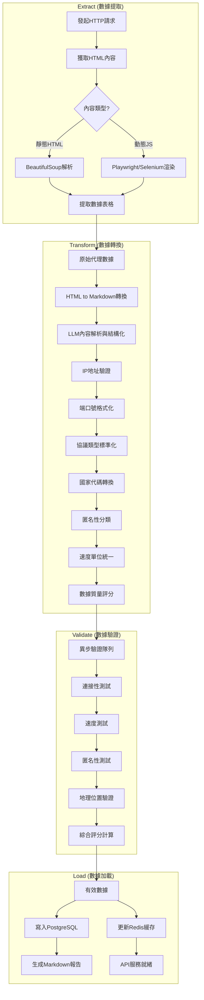

# ETL Pipeline (Brief)

This brief points to the authoritative English overview and highlights the current integration.

- Main reference: `Docs/ETL_Pipeline_Overview.md`
- Services:
  - Main API (8000): exposes `/api/*`, health `/api/health`, metrics `/metrics`
  - HTML→Markdown (8001): exposes `/health`, `/convert`, `/convert/batch`, `/upload`
- Data directories (via Docker Compose): `data/raw`, `data/processed`, `data/transformed`, `data/validated`, `data/reports`
- Migrations: Alembic runs on container start
- Monitoring: Prometheus scrapes `proxy_crawler:8000/metrics` and `html_to_markdown:8001/metrics`; Grafana on host `3001`

For full diagrams, storage paths and operational notes, see `ETL_Pipeline_Overview.md`.

## **2\. ETL 流程圖**

---

## **3\. 各階段說明與檔案存儲**

### **3.1 Extract (數據提取)**

- **目標**：從目標網站獲取原始數據
- **存放位置**：

  - `data/raw/{source}_{timestamp}.json`
  - 保存原始 HTML 表格解析後的資料

---

### **3.2 Transform (數據轉換)**

- **目標**：清洗與標準化數據（IP、Port、Protocol、Country、Anonymity、Speed 等）
- **新增模組**：
  - **HTML to Markdown 轉換**：將原始 HTML 內容轉換為結構化的 Markdown 格式
  - **LLM 內容解析與結構化**：利用大型語言模型解析 Markdown 內容，提取並結構化代理伺服器資訊
- **存放位置**：

  - `data/processed/{source}_{timestamp}.json`
  - 存儲轉換後、已加上質量分數的數據
  - `data/processed/{source}_{timestamp}.md`
  - 存儲 HTML to Markdown 轉換後的中間格式，便於 LLM 處理

---

### **3.3 Validate (數據驗證)**

- **目標**：驗證代理伺服器可用性（連接性、速度、匿名性、地理位置）並計算綜合評分
- **存放位置**：

  - `data/validated/{source}_{timestamp}.json`
  - 保存驗證結果，包含每個代理的成功率、平均延遲、是否有效

---

### **3.4 Load (數據加載)**

- **目標**：將有效數據存入資料庫與快取，並生成報告
- **存放位置**：

  - **PostgreSQL**：長期保存代理伺服器資訊
  - **Redis**：即時快取，有效代理供 API 使用
  - `data/reports/{source}_{timestamp}_proxies.md`

    - Markdown 格式報告，方便人工檢視

---

## **4\. 監控與日誌**

- **監控指標**：抓取成功率、驗證通過率、數據質量分數
- **日誌存放**：`logs/{date}.log`
- **錯誤處理**：各階段具備重試機制，確保數據完整性
