import React from 'react'

> 低保真（Lo‑fi）線框，輔助與設計/工程/利害關係人溝通 IA、佈局與互動。此檔案為 **單一 MDX**，可直接放入文檔站或設計規格。

---

# 代理伺服器管理系統 VS Code 風格五區域 Wireframe

文件目的：提供可實作導向的 UI 佈局與互動藍圖，並映射至後端服務層抽象，協助協作與規劃。

---

## 圖例（Legend）
- **□**：按鈕 / 輸入 / 區塊占位  
- **◇**：圖示位（Icon placeholder）  
- **…**：清單/表格內容延伸  
- **🔒**：付費/專業版鎖定  
- **⌨**：快捷鍵  

---

## A. 全局佈局（Desktop ≥ 1200px）

```mermaid
flowchart TB
  subgraph HEADER[Header 48px]
    H1[≡ 選單] --- H2[專案名稱]
    H2 --- H3[全局搜尋]
    H3 --- H4[工作區選擇器]
    H4 --- H5[通知中心]
    H5 --- H6[用戶選單]
    H6 --- H7[系統狀態]
  end

  subgraph BODY[ ]
    direction LR
    subgraph ABAR[活動欄 48px]
      A1[◇ 總覽\n(Ctrl+1)]
      A2[◇ 代理管理\n(Ctrl+2)]
      A3[◇ 爬蟲任務\n(Ctrl+3)]
      A4[◇ 數據分析\n(Ctrl+4)]
      A5[◇ 設置\n(Ctrl+5)]
      A6[底部：用戶頭像 / 設定]
    end

    subgraph PSIDE[主側邊欄 250px (可收合)]
      P1[動態目錄/過濾器/批次工具]
    end

    subgraph MAIN[主內容（自適應寬度）]
      M1[頁籤/子區塊]
      M2[表格/圖卡/地圖/日曆]
    end
  end

  subgraph SBar[Status Bar 22px]
    S1[左: 系統狀態\n🟢 連線 • ⚡ CPU • 💾 記憶體]
    S2[中: 操作反饋\n同步中… | 進度條 | 可取消]
    S3[右: 業務指標\n代理:1243 • 任務:5 running • v1.2.0]
  end

  HEADER --> BODY --> SBar
```

---

## B. 活動欄對應內容（主側邊欄動態）

### B1. 🌐 代理管理（Primary Sidebar）
```
代理管理
├─ 📋 代理池列表
├─ 📊 質量分析
├─ 🗺️ 地理分佈
├─ ⚡ 實時檢測
└─ 🏷️ 分類標籤

[快速過濾器] [批量操作]
```

### B2. 🕷️ 爬蟲任務（Primary Sidebar）
```
爬蟲任務
├─ 📅 任務調度
├─ ⚙️ 規則配置
├─ 📋 執行歷史
├─ 🎯 目標管理
└─ 📦 模板庫

[＋ 新建任務] [狀態篩選]
```

---

## C. 關鍵頁面 Wireframe（主內容）

### C1. 代理管理 → 代理池列表（List / Table）
```
┌──────────────────────────────────────────────────────────────────────────┐
│ [關鍵字搜尋 □□□□□□□□]  [標籤 ▾]  [質量 ▾]  [地區 ▾]    [批次操作 ▾] [匯出] │
├──────────────────────────────────────────────────────────────────────────┤
│ ☐ 全選 │ IP:Port │ 協定 │ 匿名等級 │ 國家/城市 │ 延遲 │ 可用率 │ 最後檢測 │ 操作 │
├────────┼────────┼──────┼────────┼──────────┼──────┼────────┼──────────┼──────┤
│ ☐      │ 147.⋯  │ HTTP │ Elite   │ US / SJC  │ 120ms │ 98%    │ 09:12     │ 編輯 刪除  │
│ ☐      │ 85.⋯   │ HTTPS│ Anonymous│ DE / BER │ 210ms │ 86%    │ 09:10     │ 編輯  🔒標記 │
│ …                                                                      … │
└──────────────────────────────────────────────────────────────────────────┘
[分頁 ◀ 1 2 3 ▶]    [每頁 50 ▾]    [顯示列 ▾]
```

### C2. 代理管理 → 質量分析（Charts）
```
┌─────────────┬─────────────┐
│ [可用率折線圖] │ [延遲箱型圖]  │
├─────────────┼─────────────┤
│ [失效率熱力圖] │ [地區分佈地圖]│
└─────────────┴─────────────┘
[時間範圍 ▾] [協定 ▾] [標籤 ▾] [匯出報表]
```

### C3. 爬蟲任務 → 任務調度（Calendar + List）
```
┌───────────────┬───────────────────────────────┐
│ 周/月 日曆視圖  │ 右側：即將執行清單                 │
│ ◀ 九月 2025 ▶  │ ┌───────────────┐              │
│ [新增日程]     │ │ 09:30  目標:A  週期:*/15m  │
│                 │ │ 10:00  目標:B  週期:每日    │
│  ■ ■   ■       │ │ 11:15  目標:C  單次         │
│                 │ └───────────────┘              │
└────────────────┴───────────────────────────────┘
[狀態: All ▾] [節流/併發 ▾] [執行視圖] [日誌視圖]
```

---

## D. 響應式適配

### D1. Tablet（768–1199px）
- 活動欄：**保留** 48px  
- 主側邊欄：預設 **收合**（點擊漢堡或 Ctrl+B 展開）  
- Header：搜尋框縮短，溢出功能收折到「…」  

```mermaid
flowchart LR
  A[活動欄 48px] --- B[主內容]
  B --- C[抽屜式側邊欄 (Overlay)]
  D[Status Bar 22px]
```

### D2. Mobile（≤ 767px）
- 僅顯示：活動欄（或底部 Tab）＋ 主內容  
- 側邊欄：以 **全屏抽屜** 呈現  
- Status Bar：僅顯示關鍵指標（連線/任務數）  

```mermaid
flowchart TB
  H[Header 精簡] --> M[主內容]
  A[底部導航：總覽/代理/任務/分析/設置]
  S[迷你 Status: 🟢 • 任務:3]
```



---

## E. 互動細節（微交互）
- **活動欄**：懸停 Tooltips；徽章提示；可拖拽調序  
- **側邊欄**：展收動效（200–250ms）；記憶上次狀態；⌨ **Ctrl+B** 切換  
- **主內容**：表格支援欄位顯示切換、固定、寬度拖拽；全選/批次操作  
- **Status Bar**：點擊左/中/右區域觸發細節面板；進度可取消  
- **快捷鍵**：Ctrl+1..5 切換模組；Ctrl+/ 聚焦搜尋；Ctrl+P 命令面板  

---

## F. 商業模式介面（Free → Pro）
- 活動欄底部「**免費版**」徽標；專業功能以 **🔒** 標示  
- Status Bar 顯示配額：**已用 750/1000 代理**；點擊跳升級彈窗  
- 側邊欄底部固定 **升級按鈕**；鎖定功能點擊顯示對比卡  

### 升級彈窗（Wireframe）
```
┌ 升級到 Pro ────────────────────────────────┐
│ 立即解鎖：                                 │
│  • 實時檢測頻率提升 (1m)                  │
│  • 進階報表與 API Rate 2x                 │
│  • 團隊權限 / 審計日誌                    │
│                                            │
│  月付 □□□  年付 □□□   [ 方案比較 ]       │
│             [ 立即升級 ] [ 稍後 ]          │
└───────────────────────────────────────────┘
```

---

## G. 關鍵抽屜/表單樣式

### G1. ＋ 新建爬蟲任務（右側抽屜）
```
[名稱 □□□□□□□]
[目標網址/來源 □□□□□□□] [測試]
[排程 ▾: Cron / 間隔] [預覽下一次觸發]
[併發/節流 □] [重試次數 ▾]
[代理池選擇 ▾] [健康閾值 ▾]
[保存為模板 □]

[取消]                    [建立任務]
```

### G2. 代理檢測參數（側邊設定）
```
[Ping Endpoint ▾] [超時(ms) □□□]
[檢測頻率 ▾] [最大同時連線 ▾]
[可用閾值(%) □□] [告警通道 ▾]
[保存] [套用至分組]
```

---

## H. 元件庫與樣式綱要（Design System 摘要）
- **色彩**：VS Code 深色系；主色 #3A7AFE；狀態色：成功/警告/錯誤/資訊  
- **字體**：UI Sans + Monospace（表格/日誌）  
- **圖示**：Lucide/Remix 建議；2px 線寬  
- **密度**：桌面 8px spacing scale；行高 1.4；按鈕高度 32/36/40  
- **動效**：進出場 180–220ms；陰影 8/16dp；Focus Ring 可鍵盤導航  

---

## I. 可落地的工程建議（前端）
- **技術棧**：Next.js + Tailwind + shadcn/ui + Recharts/Maplibre  
- **狀態**：TanStack Query（遠端）＋ Zustand（本地 UI 狀態）  
- **表格**：TanStack Table（虛擬捲動、欄位控制、無限載入）  
- **地圖**：Maplibre GL（離線樣式可選）  
- **圖表**：Recharts（延遲箱型圖、可用率折線、熱力圖）  
- **可用性**：WAI-ARIA；鍵盤導航；高對比主題  

---

## J. 後續擴充路線（Roadmap 摘要）
- **短期**：代理池 CRUD、健康檢測、任務調度、基本報表、升級流程  
- **中期**：團隊權限、審計日誌、API Token、告警通道（Email/Slack/Discord）  
- **長期**：自動化探測器分散式節點、成本儀表板、商業市集（代理供應商接入）  

---

### 備註
本文件為線框 / 交互藍圖，樣式細節與視覺語言可由設計系統進一步完善。

---

## 服務層抽象映射

| UI 區塊/功能 | FetchService | ValidationService | PersistenceService |
| ------------- | ------------ | ----------------- | ----------------- |
| 代理池列表 / 即時檢測 | 拉取外部來源最新 Proxy / 任務狀態 | 驗證可用性、延遲、匿名等級 | 儲存健康指標、品質分數、歷史檢測記錄 |
| 質量分析圖表 | 聚合歷史取樣資料 | 產出品質評分類目與異常標記 | 提供時間序列與統計快取 |
| 任務調度 (Calendar) | 拉取任務執行進度與排程結果 | 驗證任務配置合法/節流參數範圍 | 保存任務定義、執行日志、結果摘要 |
| 升級/配額提示 | 讀取使用情況/配額 | （配額規則檢核） | 儲存配額使用量、授權方案 |
| Status Bar 指標 | 即時系統拉取 | 健康狀態判定（綜合指標） | 儲存快照與趨勢資料 |

> 後續可依此拆分抓取 (fetch-api)、驗證 (validation-api)、儲存/查詢 (storage-api) 微服務。
