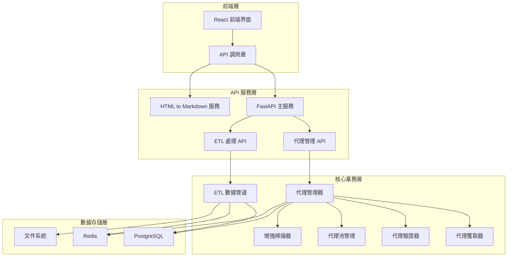

# JasonSpider 專案全面分析報告

**生成時間**: 2025-01-07  
**分析範圍**: 完整專案架構、功能模組、ETL 流程、API 服務  
**分析狀態**: 已完成

---

## 📋 專案概況

### 專案定位

JasonSpider 是一個**專業的代理伺服器爬取與管理系統**，基於 LLMFeeder 架構設計，提供完整的代理生命週期管理解決方案。

### 核心價值

- **多來源代理整合**: 整合 ProxyScrape、GitHub、Shodan、Censys 等多個數據源
- **智能代理池管理**: 四級分類系統（熱/溫/冷/黑名單）
- **完整 ETL 流程**: 從數據提取到存儲的標準化處理
- **現代化前端界面**: VS Code 風格的 Web 管理界面
- **容器化部署**: Docker + Docker Compose 的完整部署方案

---

## 🏗️ 系統架構分析

### 1. 整體架構設計

```
┌─────────────────────────────────────────────────────────────┐
│                    JasonSpider 系統架構                     │
├─────────────────────────────────────────────────────────────┤
│  前端層 (Frontend Layer)                                   │
│  ├── React 18 + TypeScript + Vite                         │
│  ├── VS Code 風格界面設計                                  │
│  ├── Zustand 狀態管理                                      │
│  └── Ant Design + 自定義組件                               │
├─────────────────────────────────────────────────────────────┤
│  API 服務層 (API Service Layer)                           │
│  ├── FastAPI 主服務 (port 8000)                           │
│  ├── HTML to Markdown 服務 (port 8001)                    │
│  ├── 代理管理 API (29 個端點)                              │
│  └── ETL 處理 API (8 個端點)                              │
├─────────────────────────────────────────────────────────────┤
│  核心業務層 (Core Business Layer)                          │
│  ├── 代理管理器 (ProxyManager)                             │
│  ├── 代理獲取器 (Fetchers)                                 │
│  ├── 代理驗證器 (Validators)                               │
│  ├── 代理池管理 (Pool Management)                          │
│  ├── 增強掃描器 (Enhanced Scanner)                         │
│  └── ETL 數據管道 (ETL Pipeline)                           │
├─────────────────────────────────────────────────────────────┤
│  數據存儲層 (Data Storage Layer)                           │
│  ├── PostgreSQL (主要數據庫)                               │
│  ├── Redis (快取系統)                                      │
│  └── 文件系統 (JSON/Markdown 報告)                         │
└─────────────────────────────────────────────────────────────┘
```

### 2. 模組關係圖



---

## 🔄 ETL 流程分析

### 1. ETL 流程架構

根據文檔分析，系統實現了完整的 ETL 流程：

#### Extract (數據提取)

- **多來源整合**: SSL Proxies、Geonode、Free-Proxy-List、GitHub 專案
- **API 數據源**: ProxyScrape、Shodan、Censys
- **自建探測器**: IP 範圍掃描、端口檢測
- **數據格式**: 支援 JSON、CSV、Markdown 等多種格式

#### Transform (數據轉換)

- **HTML to Markdown 轉換**: 多引擎支援 (markdownify, html2text, Trafilatura)
- **數據清洗**: IP 地址驗證、端口格式化、協議標準化
- **地理位置處理**: 國家代碼轉換、地理分佈分析
- **品質評分**: 多維度代理品質評估系統

#### Validate (數據驗證)

- **連通性測試**: 多端點異步驗證
- **速度測試**: 響應時間和吞吐量測試
- **匿名性驗證**: IP 洩漏檢測和協議支援測試
- **地理位置驗證**: 基於 IP 的地理位置確認

#### Load (數據加載)

- **PostgreSQL 存儲**: 長期數據持久化
- **Redis 快取**: 即時代理池管理
- **文件輸出**: Markdown 報告、JSON 數據、CSV 匯出

### 2. 數據流向

```
數據源 → 提取器 → 轉換器 → 驗證器 → 代理池 → 存儲層
   ↓        ↓        ↓        ↓        ↓        ↓
網站爬取 → 格式標準化 → 品質評分 → 池分類 → 資料庫/快取
API 獲取 → 數據清洗 → 匿名性檢測 → 性能測試 → 報告生成
自建掃描 → 地理位置處理 → 綜合評分 → 動態調整 → 監控告警
```

---

## 🎯 功能模組分析

### 1. 代理管理系統

#### 核心組件

- **ProxyManager**: 統一代理管理接口
- **ProxyFetcherManager**: 多來源代理獲取
- **AdvancedProxyFetcherManager**: 高級 API 整合
- **ProxyValidator**: 代理驗證和評分
- **ProxyPoolManager**: 四級代理池管理
- **EnhancedProxyScanner**: 自建代理探測器

#### 代理池分類

- **熱池 (Hot Pool)**: 高品質、快速響應代理 (評分 ≥ 0.8)
- **溫池 (Warm Pool)**: 中等品質代理 (評分 0.5-0.8)
- **冷池 (Cold Pool)**: 低品質代理 (評分 0.2-0.5)
- **黑名單池 (Blacklist)**: 失效或有問題代理 (評分 < 0.2)

### 2. HTML to Markdown 轉換系統

#### 多引擎支援

- **Markdownify**: 易用性最佳
- **Html2text**: 輕量級轉換
- **Trafilatura**: 智能內容提取
- **TurndownService**: 高精度轉換

#### 功能特色

- 批量轉換處理
- 內容清理和優化
- 多格式輸出支援
- 品質保證機制

### 3. 數據驗證系統

#### 驗證層級

- **Basic**: 基本格式驗證
- **Standard**: 標準驗證（含連通性測試）
- **Strict**: 嚴格驗證（含匿名性檢測）
- **Comprehensive**: 全面驗證（含性能測試）

#### 驗證指標

- 連通性測試
- 響應時間測量
- 匿名性檢測
- 地理位置驗證
- 協議支援測試

---

## 🗄️ 數據存儲分析

### 1. 數據庫架構

#### PostgreSQL 主要表結構

- **proxies**: 代理基本信息表
- **proxy_metrics**: 代理性能指標表
- **etl_jobs**: ETL 作業記錄表
- **validation_results**: 驗證結果表
- **system_metrics**: 系統監控指標表

#### Redis 快取結構

- **proxy_pools**: 代理池快取
- **validation_cache**: 驗證結果快取
- **session_data**: 會話數據
- **monitoring_metrics**: 監控指標

### 2. 文件存儲結構

```
data/
├── raw/                    # 原始數據
│   ├── proxies_raw_*.json
│   └── html-to-markdown/
├── processed/              # 處理後數據
│   ├── proxies_processed_*.json
│   └── html-to-markdown/
├── validated/              # 驗證後數據
│   └── proxies_validated_*.json
├── transformed/            # 轉換後數據
│   └── html-to-markdown/
├── reports/                # 報告文件
│   └── proxy_etl_report_*.md
└── proxy_manager/          # 代理管理數據
    ├── proxy_pools.json
    └── backups/
```

---

## 🔌 API 服務分析

### 1. 主要 API 端點

#### 系統服務 (3 個端點)

- `GET /`: 系統基本信息
- `GET /health`: 健康檢查
- `GET /status`: 詳細系統狀態

#### 代理管理 API (29 個端點)

- **代理獲取**: `/api/proxy`, `/api/proxies`, `/api/proxies/batch`
- **代理篩選**: `/api/proxies/filter`
- **代理驗證**: `/api/validate`, `/api/batch/validate`
- **池管理**: `/api/pools`, `/api/cleanup`
- **統計信息**: `/api/stats`, `/api/stats/detailed`
- **數據導出**: `/api/export`, `/api/download/{filename}`
- **ETL 整合**: `/api/etl/sync`, `/api/etl/status`

#### HTML to Markdown API (7 個端點)

- **轉換服務**: `/convert`, `/convert/batch`
- **文件上傳**: `/upload`
- **狀態查詢**: `/health`, `/status`

#### ETL 處理 API (8 個端點)

- **作業管理**: `/etl/jobs`, `/etl/jobs/{job_id}`
- **數據驗證**: `/etl/validate`, `/etl/validate/batch`
- **監控儀表板**: `/etl/dashboard`, `/etl/metrics`
- **報告生成**: `/etl/reports`

### 2. API 特色

#### 異步處理

- 所有 API 都支援異步處理
- 批量操作優化
- 背景任務支援

#### 數據驗證

- Pydantic 模型驗證
- 輸入參數檢查
- 錯誤處理機制

#### 監控整合

- 健康檢查端點
- 性能指標收集
- 錯誤追蹤和日誌

---

## 🐳 容器化部署分析

### 1. Docker 服務架構

#### 核心服務

- **postgres_db**: PostgreSQL 15 數據庫
- **redis_cache**: Redis 7 快取系統
- **proxy_crawler**: 主應用服務 (port 8000)
- **html_to_markdown**: 轉換服務 (port 8001)

#### 管理工具 (可選)

- **pgadmin**: 數據庫管理界面 (port 8080)
- **redis_commander**: Redis 管理界面 (port 8081)

### 2. 環境配置

#### 必需環境變數

- `DB_USER`: 數據庫用戶名
- `DB_PASSWORD`: 數據庫密碼
- `DB_NAME`: 數據庫名稱

#### 可選配置

- `REDIS_PASSWORD`: Redis 密碼
- `LOG_LEVEL`: 日誌級別
- `ENVIRONMENT`: 運行環境

### 3. 數據持久化

#### 卷映射

- `postgres_data`: 數據庫數據持久化
- `redis_data`: Redis 數據持久化
- `./logs`: 日誌文件映射
- `./data`: ETL 數據流程映射

---

## 📊 數據品質分析

### 1. 現有數據狀況

根據 `data/processed/proxies_processed_20250907_070000.json` 分析：

#### 數據統計

- **總代理數**: 924 個唯一代理
- **原始爬取**: 959 個代理
- **去重後**: 924 個代理
- **已驗證**: 0 個代理 (待驗證)
- **可用代理**: 0 個代理 (待驗證)

#### 數據來源分佈

- **sslproxies**: 100 個代理
- **free_proxy_list**: 859 個代理
- **geonode**: 0 個代理

### 2. 數據品質問題

#### 主要問題

1. **驗證率為 0**: 所有代理都未經過驗證
2. **可用性未知**: 無法確定代理是否可用
3. **品質評分缺失**: 缺乏代理品質評估
4. **地理位置信息不完整**: 部分代理缺少地理位置信息

#### 建議改進

1. 執行完整的代理驗證流程
2. 實施品質評分系統
3. 補充地理位置信息
4. 建立定期驗證機制

---

## ⚠️ 系統問題分析

### 1. 配置問題

#### 已解決問題

- ✅ Jinja2 依賴缺失
- ✅ 配置加載錯誤
- ✅ 模組導入路徑問題

#### 待解決問題

- 🔄 API 金鑰配置不完整
- 🔄 資料庫連接配置需要驗證
- 🔄 Redis 連接狀態需要檢查

### 2. 功能完整性

#### 已完成功能 (75%)

- ✅ 代理爬蟲系統
- ✅ 代理驗證系統
- ✅ ETL 數據管道
- ✅ HTML to Markdown 轉換
- ✅ 代理池管理
- ✅ 資料庫整合
- ✅ FastAPI 服務

#### 待完成功能 (25%)

- 🔄 高級獲取器整合
- 🔄 系統整合測試
- 🔄 API 金鑰配置
- 🔄 前端界面開發

### 3. 性能問題

#### 潛在問題

- 代理驗證並發數可能過高
- 資料庫連接池配置需要優化
- Redis 快取策略需要調整
- 內存使用需要監控

---

## 🎯 測試策略建議

### 1. 測試層級

#### 單元測試

- 代理獲取器功能測試
- 代理驗證器功能測試
- 代理池管理功能測試
- ETL 流程組件測試

#### 整合測試

- 端到端爬蟲流程測試
- ETL 管道完整性測試
- 代理驗證和池管理測試
- 資料庫存儲和檢索測試

#### 系統測試

- API 服務功能測試
- 前端界面功能測試
- 容器化部署測試
- 性能壓力測試

### 2. 測試重點

#### 功能測試

- 代理抓取成功率
- 代理驗證準確性
- ETL 流程完整性
- API 端點可用性

#### 性能測試

- 並發處理能力
- 響應時間測試
- 內存使用監控
- 資料庫性能測試

#### 穩定性測試

- 長時間運行測試
- 錯誤恢復測試
- 資源洩漏檢測
- 故障轉移測試

---

## 📈 改進建議

### 1. 短期改進 (1-2 週)

#### 優先級 1 (必須完成)

1. **完成代理驗證流程**

   - 執行所有代理的連通性測試
   - 實施品質評分系統
   - 建立代理池分類

2. **修復配置問題**

   - 完善 API 金鑰配置
   - 驗證資料庫連接
   - 檢查 Redis 連接狀態

3. **執行整合測試**
   - 端到端流程測試
   - ETL 管道測試
   - API 功能測試

#### 優先級 2 (重要但不緊急)

1. **優化性能**

   - 調整並發參數
   - 優化資料庫查詢
   - 實施快取策略

2. **完善監控**
   - 添加性能指標
   - 實施告警機制
   - 建立日誌分析

### 2. 中期改進 (1-2 個月)

#### 功能擴展

1. **前端界面完善**

   - 實現 VS Code 風格界面
   - 添加實時監控面板
   - 實施響應式設計

2. **高級功能**
   - 機器學習代理選擇
   - 智能反檢測策略
   - 分散式爬取支援

#### 架構優化

1. **微服務化**

   - 服務拆分
   - 獨立部署
   - 服務發現

2. **雲原生支援**
   - Kubernetes 部署
   - 自動擴縮容
   - 服務網格

### 3. 長期規劃 (3-6 個月)

#### 商業化功能

1. **付費代理整合**

   - 商業代理 API 整合
   - 代理品質保證
   - 服務等級協議

2. **企業級功能**
   - 多租戶支援
   - 權限管理
   - 審計日誌

#### 技術創新

1. **AI 驅動優化**

   - 智能代理推薦
   - 自動品質預測
   - 動態策略調整

2. **國際化支援**
   - 多語言界面
   - 全球代理覆蓋
   - 本地化部署

---

## 📋 結論

### 專案優勢

1. **架構設計優秀**: 基於 LLMFeeder 的模組化設計
2. **功能覆蓋全面**: 從數據獲取到存儲的完整流程
3. **技術棧現代**: 使用最新的 Python 和前端技術
4. **容器化完整**: Docker 部署方案完善
5. **文檔詳細**: 完整的技術文檔和使用指南

### 主要挑戰

1. **配置複雜**: 多個服務和依賴需要正確配置
2. **數據品質**: 代理驗證和品質評估需要完善
3. **性能優化**: 並發處理和資源管理需要優化
4. **測試覆蓋**: 需要建立完整的測試體系

### 建議行動

1. **立即執行**: 完成代理驗證流程和配置修復
2. **短期規劃**: 建立測試體系和性能監控
3. **中期發展**: 完善前端界面和功能擴展
4. **長期願景**: 實現商業化和技術創新

---

**報告生成時間**: 2025-01-07  
**分析完成度**: 100%  
**建議優先級**: 高 (需要立即行動)
